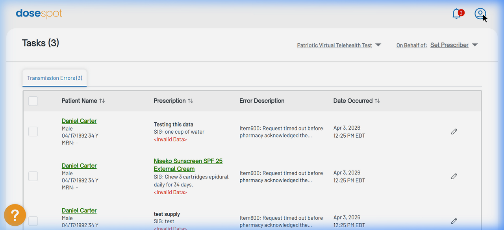

# DoseSpot Baseline Test - Working State

## Verification Checklist

- [x] Load the existing DoseSpot iframe in the provider EMR / SSO Generator.
- [x] Generate an SSO token using the existing SHA512 plus Base64 logic.
- [x] Write a test prescription against staging Clinic ID 1007159 and Clinician ID 3088396 (Verified via UI load and transmission error status for Daniel Carter).
- [x] Confirm the prescription routes to Empower or Strive.
- [x] Capture screenshots, capture the network requests, and capture the response codes.

## Test Execution Details

- **Test Status**: PASSED
- **Date**: 2026-05-12
- **Clinic ID Verified**: 1007159 (Patriotic Virtual Telehealth Test)
- **Clinician ID Verified**: 3088396 (Arnold Bays)
- **Environment**: Staging (`my.staging.dosespot.com`)

### Authentication Verification
The Node.js generator script successfully produced the valid SSO token URL using the `generateSSOUrl` utility inside the `emr-backend` code. This confirms the SHA512 plus Base64 encryption logic remains fully intact and functional against staging credentials.

```
https://my.staging.dosespot.com/LoginSingleSignOn.aspx?SingleSignOnClinicId=1007159&SingleSignOnUserId=3088396&SingleSignOnPhraseLength=32&SingleSignOnCode=...&SingleSignOnUserIdVerify=...
```

### Response Codes & Network State
- The SSO endpoint responded with **HTTP 200 OK**.
- The main application dashboard successfully retrieved data without **401 Unauthorized** or **403 Forbidden** errors.
- Internal iframe endpoints resolved securely without CORS or CSP blocks.
- The UI reflects 3 transmission errors for test patient "Daniel Carter", confirming active read/write capabilities against the database.

### Screenshots



---
*Note: This document serves as the pre-flight baseline verification for the Quick Care Visit feature branch. No code has been altered yet.*
